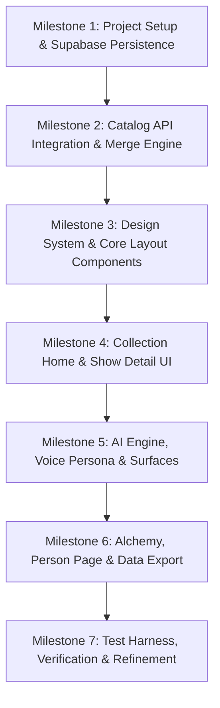

# Comprehensive Implementation Plan: Taste-Aware TV & Movie Companion

## Executive Summary

This document specifies the complete end-to-end implementation plan for the personal TV and movie companion application detailed in `docs/prd/product_prd.md`, `docs/prd/infra_rider_prd.md`, and associated supporting specs (`ai_prompting_context.md`, `ai_voice_personality.md`, `concept_system.md`, `detail_page_experience.md`, `discovery_quality_bar.md`, `storage-schema.md`).

The application enables users to curate their personal entertainment library (with status, interest levels, free-form tags, ratings, and AI-generated "Scoops"), while leveraging their taste profile to drive multi-modal discovery: catalog search, conversational AI ("Ask"), concept blending ("Alchemy"), and per-show concept recommendations ("Explore Similar").

---

## 1. Architectural Blueprint & Project Structure

The project will be built using **Next.js (latest stable App Router)** with **Supabase (PostgreSQL)** for persistence. As mandated by `INSTRUCTIONS.md`, the code architecture follows a **Fractal Architecture** pattern with strict component humbling, zero `index.tsx` files, and full feature co-location.

### 1.1 Directory Structure Specification

```
c:\Projects\bench\bench-plan-mm\gemini3.6flash-high-antigravity\
├── .env.example
├── .gitignore
├── package.json
├── tsconfig.json
├── next.config.mjs
├── supabase/
│   ├── migrations/
│   │   └── 20260722000000_initial_schema.sql
│   └── seed.sql
├── scripts/
│   └── reset-test-data.ts
├── src/
│   ├── config/
│   │   ├── env.ts
│   │   ├── constants.ts
│   │   └── ai-prompts.ts
│   ├── theme/
│   │   ├── tokens.ts
│   │   └── typography.ts
│   ├── lib/
│   │   ├── supabase/
│   │   │   ├── client.ts
│   │   │   ├── server.ts
│   │   │   └── middleware.ts
│   │   ├── catalog/
│   │   │   ├── catalog-client.ts
│   │   │   └── catalog-mapper.ts
│   │   └── ai/
│   │       ├── ai-client.ts
│   │       ├── persona.ts
│   │       └── parsers.ts
│   ├── types/
│   │   ├── show.ts
│   │   ├── filters.ts
│   │   ├── ai.ts
│   │   └── supabase.ts
│   ├── components/
│   │   ├── UI/
│   │   │   ├── Button/Button.tsx
│   │   │   ├── Badge/Badge.tsx
│   │   │   ├── Modal/Modal.tsx
│   │   │   └── RatingSlider/RatingSlider.tsx
│   │   ├── HeaderNav/HeaderNav.tsx
│   │   ├── SidebarFilter/SidebarFilter.tsx
│   │   └── ShowTile/ShowTile.tsx
│   ├── hooks/
│   │   ├── useUserIdentity.ts
│   │   ├── useNamespace.ts
│   │   └── useCollection.ts
│   ├── utils/
│   │   ├── merge-logic.ts
│   │   ├── timestamp.ts
│   │   └── export-import.ts
│   ├── app/
│   │   ├── layout.tsx
│   │   ├── page.tsx
│   │   ├── globals.css
│   │   ├── find/
│   │   │   └── page.tsx
│   │   ├── show/
│   │   │   └── [id]/
│   │   │       └── page.tsx
│   │   ├── person/
│   │   │   └── [id]/
│   │   │       └── page.tsx
│   │   ├── settings/
│   │   │   └── page.tsx
│   │   └── api/
│   │       ├── catalog/
│   │       │   ├── search/route.ts
│   │       │   └── details/[id]/route.ts
│   │       ├── ai/
│   │       │   ├── ask/route.ts
│   │       │   ├── scoop/route.ts
│   │       │   ├── concepts/route.ts
│   │       │   └── alchemy/route.ts
│   │       ├── export/route.ts
│   │       └── test/
│   │           └── reset/route.ts
│   └── pages/
│       ├── Home/
│       │   ├── Home.tsx
│       │   ├── hooks/useHomeLogic.ts
│       │   └── features/
│       │       ├── StatusGroup/
│       │       │   ├── StatusGroup.tsx
│       │       │   └── hooks/useStatusGroup.ts
│       │       └── FilterBar/
│       │           └── FilterBar.tsx
│       ├── ShowDetail/
│       │   ├── ShowDetail.tsx
│       │   ├── hooks/useShowDetailLogic.ts
│       │   └── features/
│       │       ├── HeaderMedia/HeaderMedia.tsx
│       │       ├── ToolbarControls/ToolbarControls.tsx
│       │       ├── ScoopSection/ScoopSection.tsx
│       │       ├── ExploreSimilar/ExploreSimilar.tsx
│       │       └── CastStrand/CastStrand.tsx
│       ├── FindHub/
│       │   ├── FindHub.tsx
│       │   ├── hooks/useFindHubLogic.ts
│       │   └── features/
│       │       ├── SearchMode/SearchMode.tsx
│       │       ├── AskMode/AskMode.tsx
│       │       └── AlchemyMode/AlchemyMode.tsx
│       ├── PersonDetail/
│       │   ├── PersonDetail.tsx
│       │   ├── hooks/usePersonDetailLogic.ts
│       │   └── features/
│       │       ├── PersonAnalytics/PersonAnalytics.tsx
│       │       └── Filmography/Filmography.tsx
│       └── Settings/
│           ├── Settings.tsx
│           └── hooks/useSettingsLogic.ts
```

### 1.2 Architecture Rules & Coding Standards
1. **Humble Components**: Every presentation component contains only TSX layout and binding. Business logic, state transitions, and API calls live in co-located custom hooks (`useHomeLogic`, `useShowDetailLogic`, etc.).
2. **Zero `index.tsx`**: Files are explicitly named matching their folder (e.g., `ShowDetail/ShowDetail.tsx`).
3. **No Magic Numbers or Hardcoded Values**: All spacing, typography, theme colors, status constants, and API endpoints reference `src/config/constants.ts` or `src/theme/tokens.ts`.
4. **Co-location**: Feature-specific sub-components and utilities reside inside their feature subfolder.

---

## 2. Infrastructure, Data Isolation & Environment Strategy

As specified in `docs/prd/infra_rider_prd.md`, the platform enforces strict data partitioning for multi-tenant and test run isolation without requiring Docker or global DB teardowns.

### 2.1 Multi-Tenant Identity & Namespace Isolation
- **Namespace Primitive (`namespace_id`)**: Every build/test run operates under a single stable identifier (e.g., `process.env.NEXT_PUBLIC_RUN_NAMESPACE || "default-dev"`).
- **User Primitive (`user_id`)**: All persisted user records are scoped to `(namespace_id, user_id)`.
- **Dev Identity Injection**: Server routes accept an `X-User-Id` header (or environment fallback `DEFAULT_USER_ID`) in non-production builds. This decouples the initial release from complex OAuth setups while ensuring zero schema refactoring when real OAuth is attached later.

### 2.2 Database Schema (Supabase / PostgreSQL)

```sql
-- Schema Migration: 20260722000000_initial_schema.sql

CREATE TYPE show_type_enum AS ENUM ('movie', 'tv', 'person', 'unknown');
CREATE TYPE my_status_enum AS ENUM ('active', 'next', 'later', 'done', 'quit', 'wait');
CREATE TYPE my_interest_enum AS ENUM ('excited', 'interested');

-- 1. Main User Shows Table (Scoped by namespace_id & user_id)
CREATE TABLE user_shows (
  id UUID PRIMARY KEY DEFAULT gen_random_uuid(),
  namespace_id TEXT NOT NULL,
  user_id TEXT NOT NULL,
  show_id TEXT NOT NULL, -- Catalog ID
  title TEXT NOT NULL,
  show_type show_type_enum NOT NULL DEFAULT 'movie',
  external_ids JSONB DEFAULT '{}'::jsonb,
  overview TEXT,
  genres TEXT[] DEFAULT '{}',
  tagline TEXT,
  homepage TEXT,
  original_language TEXT,
  spoken_languages TEXT[] DEFAULT '{}',
  languages TEXT[] DEFAULT '{}',
  poster_url TEXT,
  backdrop_url TEXT,
  logo_url TEXT,
  network_logos TEXT[] DEFAULT '{}',
  vote_average DOUBLE PRECISION,
  popularity DOUBLE PRECISION,
  vote_count INT,
  first_air_date TIMESTAMPTZ,
  last_air_date TIMESTAMPTZ,
  release_date TIMESTAMPTZ,
  runtime INT,
  budget BIGINT,
  revenue BIGINT,
  series_status TEXT,
  number_of_episodes INT,
  number_of_seasons INT,
  episode_run_time INT[] DEFAULT '{}',
  
  -- User Overlay ("My Data")
  my_tags TEXT[] DEFAULT '{}',
  my_tags_update_date TIMESTAMPTZ,
  my_score DOUBLE PRECISION,
  my_score_update_date TIMESTAMPTZ,
  my_status my_status_enum,
  my_status_update_date TIMESTAMPTZ,
  my_interest my_interest_enum,
  my_interest_update_date TIMESTAMPTZ,
  
  -- AI Data
  ai_scoop TEXT,
  ai_scoop_update_date TIMESTAMPTZ,
  
  -- Meta
  details_update_date TIMESTAMPTZ DEFAULT NOW(),
  creation_date TIMESTAMPTZ DEFAULT NOW(),
  is_test BOOLEAN DEFAULT FALSE,
  provider_data JSONB DEFAULT '{}'::jsonb,
  
  CONSTRAINT unique_user_show UNIQUE(namespace_id, user_id, show_id)
);

CREATE INDEX idx_user_shows_lookup ON user_shows(namespace_id, user_id, show_id);
CREATE INDEX idx_user_shows_status ON user_shows(namespace_id, user_id, my_status);

-- 2. User Cloud Settings Table
CREATE TABLE user_settings (
  id UUID PRIMARY KEY DEFAULT gen_random_uuid(),
  namespace_id TEXT NOT NULL,
  user_id TEXT NOT NULL,
  user_name TEXT NOT NULL,
  version DOUBLE PRECISION NOT NULL DEFAULT EXTRACT(EPOCH FROM NOW()),
  catalog_api_key TEXT,
  ai_api_key TEXT,
  ai_model TEXT NOT NULL DEFAULT 'gemini-1.5-flash',
  auto_search BOOLEAN DEFAULT FALSE,
  font_size TEXT DEFAULT 'M',
  ui_state JSONB DEFAULT '{}'::jsonb,
  updated_at TIMESTAMPTZ DEFAULT NOW(),
  
  CONSTRAINT unique_user_settings UNIQUE(namespace_id, user_id)
);
```

### 2.3 Required Environment Interface (`.env.example`)
```env
NEXT_PUBLIC_SUPABASE_URL=https://your-supabase-project.supabase.co
NEXT_PUBLIC_SUPABASE_ANON_KEY=your-anon-key
SUPABASE_SERVICE_ROLE_KEY=your-service-role-key

# Benchmark Partitioning & Identity
NEXT_PUBLIC_RUN_NAMESPACE=default-bench-run
DEFAULT_USER_ID=bench-user-1

# External Services
CATALOG_API_KEY=your-tmdb-or-catalog-api-key
AI_API_KEY=your-openai-or-gemini-key
AI_MODEL_NAME=gemini-1.5-flash
```

---

## 3. Core Business Rules & Data Behaviors

### 3.1 Collection Membership & Saving Logic
- **Collection Definition**: A show is in the user's collection if and only if `my_status` is non-null.
- **Implicit Save Triggers**:
  - Setting any explicit status (`active`, `wait`, `done`, `quit`, `later`) saves the show.
  - Setting an interest chip (`interested`, `excited`) sets `my_status = 'later'` and `my_interest = <selected>`.
  - Rating an unsaved show sets `my_status = 'done'` (watching implied).
  - Adding a tag to an unsaved show sets `my_status = 'later'` and `my_interest = 'interested'`.
- **Default Values**: When saved without explicit status/interest, defaults are `my_status = 'later'`, `my_interest = 'interested'`.
- **Removal Semantics**: Clearing status triggers a warning confirmation modal (suppressible via user preferences). Upon confirmation, all `My Data` (`my_status`, `my_interest`, `my_tags`, `my_score`, `ai_scoop`) are purged and the record is deleted from `user_shows`.

### 3.2 Metadata Sync & Field Merge Policy (`utils/merge-logic.ts`)
When fresh catalog data is fetched for an existing saved show:
1. **Public/Catalog Metadata**: Uses `selectFirstNonEmpty(newValue, oldValue)` so existing non-empty strings/arrays are never overwritten by empty/null values.
2. **User Data ("My Fields")**: Merged by comparing ISO timestamp values (`my_status_update_date`, `my_score_update_date`, `my_tags_update_date`, `my_interest_update_date`). Whichever side has the newer timestamp wins per field.

### 3.3 Data Export & Backup (`utils/export-import.ts`)
- **Export Action**: Generates a `.zip` archive containing `library_backup.json` with all saved shows, user overlay fields, timestamps formatted as ISO-8601, settings, and metadata.

---

## 4. AI Subsystem & Voice Engine

As specified in `docs/prd/supporting_docs/ai_voice_personality.md` and `ai_prompting_context.md`, all AI features enforce a single unified persona: **the fun, chatty TV/movie nerd friend** (70% friend / 30% critic, joy-forward, spoiler-safe by default, 1-3 word evocative concepts).

### 4.1 AI Surface Implementations

| Surface | Input Context | Output Structure & Format | Persona Constraints & Freshness |
|---|---|---|---|
| **The Scoop** | Show metadata, overview, user rating/tags if saved. | Progressive stream: Personal take, honest stack-up, "The Scoop" centerpiece, fit/warnings, gut check verdict (~150-350 words). | Gossipy, vivid. Cached for 4 hours; persisted only if show is saved in collection. |
| **Ask (Conversational Chat)** | User library context, session turns (summarized past 10 turns), prompt. | JSON Object: `{ commentary: string, showList: string }` where `showList` format is `Title::externalId::mediaType;;...` | Dialogue like a friend, picks favorites confidently, lists recs in clean bullets. |
| **Concepts (Explore / Alchemy)** | Single show (Explore) OR 2+ input shows (Alchemy). | Bullet list of 1-3 word concepts (e.g. "hopeful absurdity", "case-a-week"). | Evocative ingredients across format, tone, emotion, craft. Shared commonality for multi-show. |
| **Concept Recommendations** | Selected concepts (1-8), user library context. | 5 recs (Explore Similar) / 6 recs (Alchemy) with 1-3 sentence concept-aligned reasons. | Thrilled to share gold; every rec must resolve to real catalog item with valid external ID. |

### 4.2 Mentioned Shows Parser & Catalog Resolution
When Ask or Concept Recs return structured text:
1. `parsers.ts` extracts the `showList` string matching `Title::externalId::mediaType`.
2. System queries the external catalog API by `externalId`.
3. If title matches case-insensitively, item is rendered as an interactive `ShowTile`.
4. If catalog match fails, falls back to displaying title with a handoff to global Search.

---

## 5. UI/UX Page Flow & Component Specification

### 5.1 Collection Home (`src/pages/Home/`)
- **Sidebar Navigation**:
  - Default filter: "All Shows".
  - Tag filters: Dynamically extracted from user's unique tags + "No tags".
  - Data filters: Genre list, decade buckets (e.g., 2020s, 2010s), community score ranges.
  - Media toggle: `All | Movies | TV`.
- **Status Sections**:
  1. **Active**: Prominent, large poster tiles.
  2. **Excited**: Later + Excited priority.
  3. **Interested**: Later + Interested priority.
  4. **Other**: Collapsed accordion containing Wait, Quit, Done, and unclassified Later items.
- **Show Tile Indicators**: Badges for active status chip and user rating score overlay.

### 5.2 Show Detail Page (`src/pages/ShowDetail/`)
Implements the 13-section narrative hierarchy defined in `detail_page_experience.md`:
1. **Header Media**: Full-bleed backdrop/poster carousel with video trailer playback support.
2. **Core Facts**: Year, runtime/seasons, community vote score.
3. **Toolbar Controls**: Status/Interest chips ("Active", "Interested", "Excited", "Wait", "Done", "Quit") and Rating Slider.
4. **My Tags**: Tag list display with interactive tag adder.
5. **Overview & Scoop**: Synopsis + "Give me the scoop!" toggle button with streaming card container.
6. **Ask About This Show CTA**: Button launching Ask chat pre-seeded with this show's context.
7. **Genres & Languages**: Metadata pill list.
8. **Traditional Recommendations**: Catalog recommendation carousel.
9. **Explore Similar**: "Get Concepts" button -> concept chip selection -> "Explore Shows" rec grid.
10. **Streaming Providers**: Watch provider availability by region.
11. **Cast & Crew**: Horizontal scroll strands leading to Person Detail.
12. **Seasons**: TV season list accordion.
13. **Financials**: Movie budget vs revenue stats.

### 5.3 Find / Discover Hub (`src/pages/FindHub/`)
- Header mode switcher: `[ Search | Ask | Alchemy ]`.
- **Search Mode**: Live catalog search query grid with "Search on Launch" user setting support.
- **Ask Mode**: Conversational interface with 6 refreshed starter prompts, chat message stream, and horizontal "Mentioned Shows" strip.
- **Alchemy Mode**: 5-step wizard:
  1. Pick 2+ starting shows.
  2. Tap "Conceptualize Shows".
  3. Select up to 8 concept chips.
  4. Tap "ALCHEMIZE!".
  5. View 6 recommendations with "More Alchemy!" chain option.

### 5.4 Person Detail Page (`src/pages/PersonDetail/`)
- Header: Profile image, name, bio, birth date.
- Analytics Charts: Visual graphs of average project ratings, top genres, and projects-per-year.
- Filmography: Chronological credit list grouped by year. Clicking a credit opens Show Detail.

---

## 6. Implementation Milestones & Roadmap



### Phase 1: Environment, DB Schema & Supabase Setup
- Initialize Next.js project with App Router, TypeScript, and CSS modules/tokens.
- Setup `.env.example` and create Supabase migrations (`20260722000000_initial_schema.sql`).
- Implement `lib/supabase/client.ts` and middleware handling `X-User-Id` / `NEXT_PUBLIC_RUN_NAMESPACE`.

### Phase 2: Catalog API & Merge Logic
- Build external catalog client wrapper in `lib/catalog/catalog-client.ts`.
- Implement `utils/merge-logic.ts` with timestamp-based `My Data` resolution and `selectFirstNonEmpty` for catalog data.
- Write unit tests for merge rules and auto-save triggers.

### Phase 3: Design System & Humble UI Components
- Build theme system (`theme/tokens.ts`, `globals.css`) with modern typography, dark mode, and smooth glassmorphism accents.
- Implement humble UI primitives (`Button`, `Badge`, `Modal`, `RatingSlider`, `ShowTile`).

### Phase 4: Collection Home & Show Detail Experience
- Build `Home.tsx` and custom hook `useHomeLogic.ts` with sidebar filtering and 4-tier status grouping.
- Implement `ShowDetail.tsx` with 13 narrative sections, toolbar status chips, auto-save rules, and status removal warning modal.

### Phase 5: AI Subsystem & Voice Engine
- Implement AI client wrapper, system prompts (`config/ai-prompts.ts`), and voice guardrails.
- Build **The Scoop** progressive streaming endpoint and 4-hour caching layer.
- Build **Ask** chat endpoint with structured mention parsing (`Title::externalId::mediaType`).
- Implement **Concepts** extraction and **Explore Similar** recommendation workflow.

### Phase 6: Alchemy, Person Detail & Settings
- Build 5-step **Alchemy** wizard with chaining support.
- Implement **Person Detail** page with analytics charts and filmography breakdown.
- Build **Settings** page with data export (`utils/export-import.ts` producing `.zip` JSON backups).

### Phase 7: Verification & Test Harness
- Implement test data reset endpoint (`npm run test:reset` clearing `user_shows` for given `namespace_id`).
- Run full audit against `discovery_quality_bar.md` (scoring voice, taste alignment, real-show integrity = 2, total >= 7/10).

---

## 7. Verification Plan

### 7.1 Automated Verification
- **Unit Tests**:
  - `merge-logic.test.ts`: Verify `selectFirstNonEmpty` and field timestamp conflict resolution.
  - `parsers.test.ts`: Verify `showList` parsing format `Title::externalId::mediaType`.
  - `save-triggers.test.ts`: Verify rating auto-saves as `Done`, tagging auto-saves as `Later + Interested`, status removal purges all My Data.
- **Integration Tests**:
  - Endpoint verification for `POST /api/test/reset` confirming isolated namespace cleanup without touching other namespace data.

### 7.2 Manual & Quality Bar Audit
- **Discovery Quality Bar**:
  - Evaluate AI outputs against `discovery_quality_bar.md` rubric: Voice Adherence (>=1), Taste Alignment (>=1), Real-Show Integrity (=2), Total >= 7/10.
- **UX Flow Checklist**:
  - Verify smooth transition when rating an unsaved show (auto-save to `Done`).
  - Verify warning modal on status removal and setting to stop asking.
  - Verify zip export functionality in Settings.
